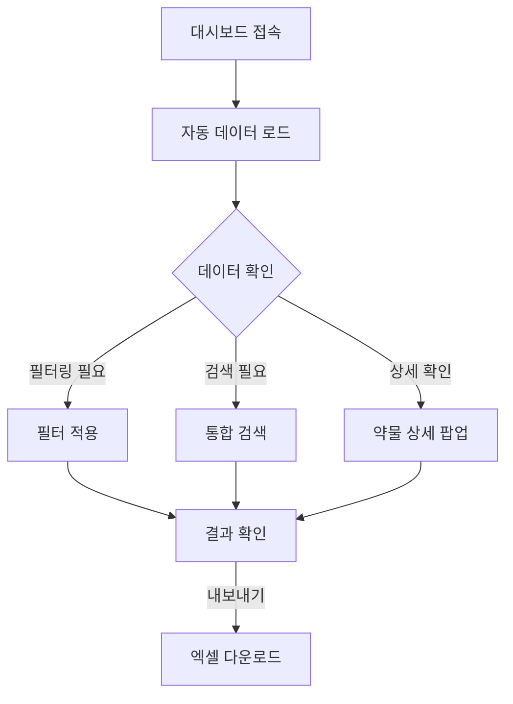
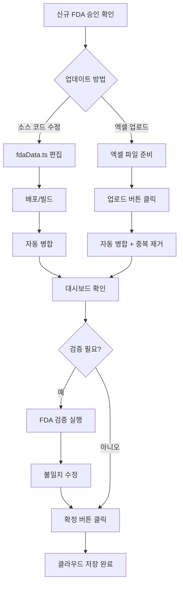
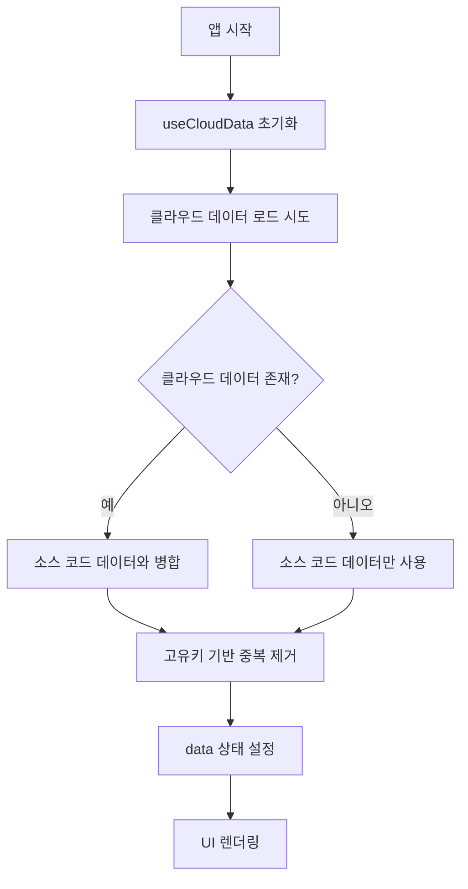
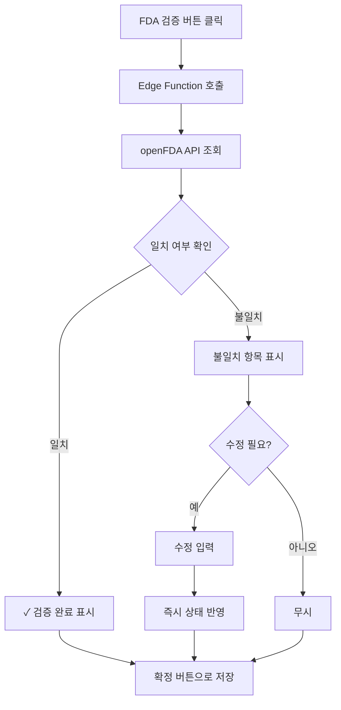

# US FDA 승인 전문의약품 대시보드 - 기술 문서

## 목차
1. [개요](#개요)
2. [기술 스택](#기술-스택)
3. [데이터 아키텍처](#데이터-아키텍처)
4. [핵심 기능](#핵심-기능)
5. [워크플로우](#워크플로우)
6. [핵심 컴포넌트](#핵심-컴포넌트)
7. [데이터 관리](#데이터-관리)
8. [파일 구조](#파일-구조)
9. [개발 가이드](#개발-가이드)

---

## 개요

미국 FDA 전문의약품 승인 데이터를 시각화하고 관리하는 대시보드 애플리케이션입니다. 

### 데이터 범위
- **포함**: 신약(NDA/BLA) 최초 승인, 제형 변경, 조합 제품, 적응증 추가 등 전문의약품의 주요 승인 내역
- **제외**: 제네릭 의약품(ANDA), 일반의약품(OTC)

### 주요 특징
- 클라우드 기반 데이터 영속성 (Lovable Cloud)
- 소스 코드와 클라우드 데이터 자동 병합
- openFDA API 연동 검증
- 다국어 지원 (한글/영문)

---

## 기술 스택

| 분류 | 기술 |
|------|------|
| **프레임워크** | React 18 + TypeScript |
| **빌드 도구** | Vite |
| **스타일링** | Tailwind CSS + shadcn/ui |
| **차트** | Recharts |
| **엑셀 처리** | ExcelJS |
| **백엔드** | Lovable Cloud (Supabase Edge Functions) |
| **데이터베이스** | PostgreSQL (Supabase) |
| **상태 관리** | React useState + useMemo + Custom Hooks |

---

## 데이터 아키텍처

### 데이터 인터페이스 (`DrugApproval`)

```typescript
interface DrugApproval {
  applicationNo: string;        // 허가번호 (숫자만)
  applicationType: "NDA" | "BLA";
  brandName: string;            // 제품명 (영문)
  brandNameKorean?: string;     // 제품명 (국문)
  activeIngredient: string;     // 성분명 (영문)
  activeIngredientKorean?: string;
  sponsor: string;              // 제조사
  approvalDate: string;         // YYYY-MM-DD
  approvalMonth: string;        // YYYY-MM
  therapeuticArea: string;      // 치료 영역
  indicationFull?: string;      // 적응증 (상세)
  isOncology: boolean;          // 항암제 여부
  isBiosimilar: boolean;        // 바이오시밀러 여부
  isNovelDrug: boolean;         // 신약 여부
  isOrphanDrug: boolean;        // 희귀의약품 여부
  ndaBlaNumber: string;         // "NDA 123456" 형식
  fdaUrl?: string;              // FDA 공식 링크
  supplementCategory?: string;  // 변경 카테고리 (ORIG-1, SUPPL 등)
  isCberProduct?: boolean;      // CBER 규제 제품 여부
  approvalType?: string;        // 승인 유형 (정규승인, 가속승인 등)
  notes?: string;               // 비고
}
```

### 데이터 계층 구조

```
┌─────────────────────────────────────────────────────────────────┐
│                      사용자 인터페이스                            │
├─────────────────────────────────────────────────────────────────┤
│  ┌──────────┐  ┌──────────┐  ┌──────────┐  ┌──────────────┐    │
│  │ StatCard │  │ Filters  │  │DrugTable │  │TherapeuticChart│  │
│  └──────────┘  └──────────┘  └──────────┘  └──────────────┘    │
├─────────────────────────────────────────────────────────────────┤
│                    상태 관리 (Index.tsx)                         │
│  ┌─────────────────────────────────────────────────────────┐   │
│  │   useCloudData Hook → data ←→ filters ←→ filteredData   │   │
│  └─────────────────────────────────────────────────────────┘   │
├─────────────────────────────────────────────────────────────────┤
│                    데이터 계층                                   │
│  ┌─────────────────┐     ┌─────────────────┐                   │
│  │ 소스 코드 데이터  │ ←→  │  클라우드 데이터  │                   │
│  │ (fdaData.ts)    │     │  (Supabase DB)  │                   │
│  └─────────────────┘     └─────────────────┘                   │
│              ↓                     ↓                            │
│         ┌─────────────────────────────────────┐                │
│         │        병합 (Merge) 로직             │                │
│         │  클라우드 우선 + 소스 신규 항목 추가   │                │
│         └─────────────────────────────────────┘                │
└─────────────────────────────────────────────────────────────────┘
```

### 데이터베이스 스키마

```sql
-- 데이터 버전 관리
CREATE TABLE fda_data_versions (
  id UUID PRIMARY KEY DEFAULT gen_random_uuid(),
  version_number SERIAL,
  created_at TIMESTAMPTZ DEFAULT now(),
  created_by UUID REFERENCES auth.users,
  is_verified BOOLEAN DEFAULT false,
  is_published BOOLEAN DEFAULT false,
  data_fingerprint TEXT,
  notes TEXT
);

-- 실제 데이터 저장
CREATE TABLE fda_data_rows (
  id UUID PRIMARY KEY DEFAULT gen_random_uuid(),
  version_id UUID REFERENCES fda_data_versions(id),
  payload JSONB NOT NULL  -- DrugApproval 객체
);
```

---

## 핵심 기능

### 1. 데이터 시각화

| 기능 | 설명 |
|------|------|
| **통계 카드** | 전체 건수, 항암제, 바이오시밀러, 신약, 희귀의약품, NDA/BLA 비율 |
| **치료영역 차트** | 도넛 차트로 치료 영역별 분포 시각화 |
| **하이라이트** | 최신/최다 승인 정보 요약 |

### 2. 필터링 시스템

| 필터 | 옵션 |
|------|------|
| **승인일** | 전체, 직접 선택, 1개월, 3개월, 6개월, 1년, 2년 |
| **신청 유형** | 전체, NDA, BLA |
| **제약사** | 동적 목록 (데이터 기반) |
| **치료 영역** | 동적 목록 (데이터 기반) |
| **항암제** | 전체, Y, N |
| **바이오시밀러** | 전체, Y, N |
| **신약** | 전체, Y, N |
| **희귀의약품** | 전체, Y, N |

### 3. 데이터 관리

| 기능 | 설명 |
|------|------|
| **엑셀 업로드** | 기존 데이터와 병합 (중복 제거) |
| **엑셀 내보내기** | 다중 시트 (Summary, 국문, 영문, 최초승인, 변경승인) |
| **FDA 검증** | openFDA API로 브랜드명/스폰서 일치 확인 |
| **클라우드 확정** | 현재 데이터를 클라우드에 영구 저장 |

### 4. 검색 기능

통합 검색 지원:
- 제품명 (영문/국문)
- 성분명
- 스폰서
- 치료 영역
- 허가번호

---

## 워크플로우

### 일반 사용 워크플로우



### 데이터 업데이트 워크플로우



### 초기 로드 흐름



### FDA 검증 워크플로우



---

## 핵심 컴포넌트

### 1. Index.tsx (메인 페이지)

**역할**: 전체 상태 관리 및 컴포넌트 조합

```typescript
export default function Index() {
  const { data, isLoading, cloudVersion, updateData, saveToCloud } = useCloudData();
  const [filters, setFilters] = useState<FilterState>(defaultFilters);
  
  const filteredData = useMemo(() => applyFilters(data, filters), [data, filters]);
  
  const stats = useMemo(() => ({
    total: filteredData.length,
    oncology: filteredData.filter(d => d.isOncology).length,
    // ... 기타 통계
  }), [filteredData]);
  
  return (
    <div>
      <Header version={cloudVersion} onSave={saveToCloud} />
      <Filters data={data} filters={filters} onFilterChange={setFilters} />
      <StatCards stats={stats} />
      <DrugTable data={filteredData} onDataChange={updateData} />
    </div>
  );
}
```

### 2. useCloudData.ts (데이터 관리 훅)

**역할**: 클라우드/소스 데이터 병합 및 상태 관리

```typescript
export function useCloudData() {
  const [state, setState] = useState<CloudDataState>({
    data: fdaApprovals,
    isLoading: true,
    cloudVersion: null,
    cloudUpdatedAt: null,
  });

  // 초기 로드 - 클라우드 + 소스 병합
  useEffect(() => {
    const init = async () => {
      const cloudResult = await loadFromCloud();
      if (cloudResult) {
        const mergedData = mergeSourceWithCloud(fdaApprovals, cloudResult.data);
        setState({ data: mergedData, cloudVersion: cloudResult.version, ... });
      }
    };
    init();
  }, []);

  // 클라우드 저장
  const saveToCloud = async () => {
    await supabase.functions.invoke('persist-fda-data', {
      body: { action: 'save', data: state.data }
    });
  };

  return { ...state, updateData, saveToCloud };
}
```

### 3. Filters.tsx (필터링)

**역할**: 다양한 조건으로 데이터 필터링

```typescript
export function applyFilters(data: DrugApproval[], filters: FilterState): DrugApproval[] {
  // 데이터셋 내 최신 승인일을 기준점으로 사용
  const reference = getLatestApprovalDate(data);
  
  return data.filter((drug) => {
    // 날짜 필터
    if (filters.dateRange !== "all") { /* 날짜 범위 확인 */ }
    // 유형 필터
    if (filters.applicationType !== "all" && drug.applicationType !== filters.applicationType) return false;
    // Boolean 필터
    if (filters.isOncology !== "all" && drug.isOncology !== (filters.isOncology === "true")) return false;
    // ... 기타 필터
    return true;
  });
}
```

### 4. DrugTable.tsx (데이터 테이블)

**기능**:
- 통합 검색
- 상세 정보 팝업 (Dialog)
- FDA 링크 연결
- CBER 제품 배지 표시

### 5. FdaValidation.tsx (FDA 검증)

**기능**:
- openFDA API로 브랜드명/스폰서 검증
- 불일치 항목 하이라이트
- 인라인 수정 → 즉시 상태 반영

### 6. DataCommit.tsx (클라우드 저장)

**기능**:
- 현재 데이터를 클라우드에 영구 저장
- 버전 관리 (자동 버전 번호 증가)
- 저장 노트 추가 가능

---

## 데이터 관리

### 중복 제거 로직

고유 키 구성: `applicationNo + approvalDate + supplementCategory`

```typescript
function mergeSourceWithCloud(source: DrugApproval[], cloud: DrugApproval[]): DrugApproval[] {
  const seen = new Set<string>();
  const result: DrugApproval[] = [];
  
  // 클라우드 데이터 우선 추가
  for (const drug of cloud) {
    const key = `${drug.applicationNo}-${drug.approvalDate}-${drug.supplementCategory || ""}`;
    if (!seen.has(key)) {
      seen.add(key);
      result.push(drug);
    }
  }
  
  // 소스 데이터 중 클라우드에 없는 항목 추가
  for (const drug of source) {
    const key = `${drug.applicationNo}-${drug.approvalDate}-${drug.supplementCategory || ""}`;
    if (!seen.has(key)) {
      seen.add(key);
      result.push(drug);
    }
  }
  
  return result;
}
```

### 허가번호 정규화

```typescript
// 중복 접두어 제거: "BLA BLA 123456" → "BLA 123456"
const normalizeApplicationNo = (appNo: string): string => {
  return appNo.replace(/^(BLA|NDA)\s+(BLA|NDA)\s+/i, "$1 ").trim();
};
```

### FDA URL 생성 규칙

1. **명시적 fdaUrl 필드**: 있으면 그대로 사용
2. **CBER 제품 매핑**: 브랜드명 기반 하드코딩 URL
3. **CDER 제품**: Drugs@FDA 동적 쿼리

```typescript
const getFdaUrl = (drug: DrugApproval): string => {
  if (drug.fdaUrl) return drug.fdaUrl;
  if (CBER_PRODUCT_URLS[drug.brandName]) return CBER_PRODUCT_URLS[drug.brandName];
  return `https://www.accessdata.fda.gov/scripts/cder/daf/index.cfm?event=overview.process&ApplNo=${drug.applicationNo}`;
};
```

---

## 파일 구조

```
📁 프로젝트 루트
├── 📁 src/
│   ├── 📁 pages/
│   │   └── Index.tsx                # 메인 대시보드 페이지
│   ├── 📁 components/
│   │   └── 📁 dashboard/
│   │       ├── Header.tsx           # 헤더 (메타정보, 액션 버튼)
│   │       ├── Filters.tsx          # 필터링 UI 및 로직
│   │       ├── DrugTable.tsx        # 데이터 테이블
│   │       ├── StatCard.tsx         # 통계 카드
│   │       ├── TherapeuticAreaChart.tsx  # 치료영역 차트
│   │       ├── Highlights.tsx       # 주요 하이라이트
│   │       ├── FdaValidation.tsx    # FDA API 검증
│   │       ├── FdaNovelDrugsExport.tsx   # 엑셀 내보내기
│   │       ├── ExcelUpload.tsx      # 엑셀 업로드
│   │       ├── DataCommit.tsx       # 클라우드 저장
│   │       └── UsageGuide.tsx       # 사용 가이드
│   ├── 📁 data/
│   │   └── fdaData.ts               # 기본 데이터 및 타입 정의
│   ├── 📁 hooks/
│   │   ├── useCloudData.ts          # 클라우드 데이터 관리 훅
│   │   └── useAuth.ts               # 인증 훅
│   └── 📁 integrations/
│       └── 📁 supabase/
│           ├── client.ts            # Supabase 클라이언트
│           └── types.ts             # 자동 생성 타입
├── 📁 supabase/
│   └── 📁 functions/
│       ├── 📁 validate-fda-data/    # FDA 검증 Edge Function
│       │   └── index.ts
│       └── 📁 persist-fda-data/     # 클라우드 저장 Edge Function
│           └── index.ts
└── 📁 docs/
    └── DASHBOARD_IMPLEMENTATION.md  # 본 문서
```

---

## 개발 가이드

### 새로운 데이터 필드 추가

1. `src/data/fdaData.ts`에서 `DrugApproval` 인터페이스 수정
2. 기존 데이터에 새 필드 추가 (기본값 설정)
3. 관련 컴포넌트 업데이트:
   - `DrugTable.tsx` - 테이블 컬럼/상세 팝업
   - `Filters.tsx` - 필요시 필터 추가
   - `FdaNovelDrugsExport.tsx` - 엑셀 내보내기
   - `ExcelUpload.tsx` - 엑셀 업로드 매핑

### 새로운 필터 추가

1. `Filters.tsx`의 `FilterState` 인터페이스 확장
2. 초기값 설정 (`Index.tsx`의 `defaultFilters`)
3. `applyFilters` 함수에 필터 로직 추가
4. UI 컴포넌트 추가 (Select 등)

### Edge Function 수정

1. `supabase/functions/[function-name]/index.ts` 수정
2. 저장 시 자동 배포
3. `supabase--edge-function-logs`로 디버깅

### 데이터 추가 방법

**방법 1: 소스 코드 직접 편집**
```typescript
// src/data/fdaData.ts에 새 항목 추가
{
  approvalMonth: "2026-01",
  approvalDate: "2026-01-28",
  ndaBlaNumber: "NDA 220142",
  applicationNo: "220142",
  applicationType: "NDA",
  brandName: "YUVEZZI",
  // ... 기타 필드
}
```

**방법 2: 엑셀 업로드**
- 기존 데이터와 자동 병합
- 중복 자동 제거
- 새 항목만 추가됨

---

## 주의사항

1. **데이터 정합성**: 모든 허가번호는 공식 FDA 데이터와 대조 검증 필요
2. **CBER 제품**: 별도 URL 매핑 필요 (자동 생성 불가)
3. **ANDA 제외**: 제네릭 의약품은 데이터셋에 포함하지 않음
4. **OTC 제외**: 일반의약품은 데이터셋에 포함하지 않음
5. **FDA API 제한**: Rate limit 40 req/min (API key 없이)
6. **클라우드 저장**: 확정 버튼 클릭 전까지는 브라우저 새로고침 시 소스 코드 기준으로 리셋

---

## 버전 히스토리

| 버전 | 날짜 | 변경 내용 |
|------|------|----------|
| v7 | 2026-01-30 | 클라우드 저장 인증 제거, 익명 저장 허용 |
| v6 | 2026-01-29 | 소스-클라우드 데이터 병합 로직 추가 |
| v5 | 2026-01-28 | 클라우드 영속성 시스템 구축 |

---

*최종 업데이트: 2026-01-30*
